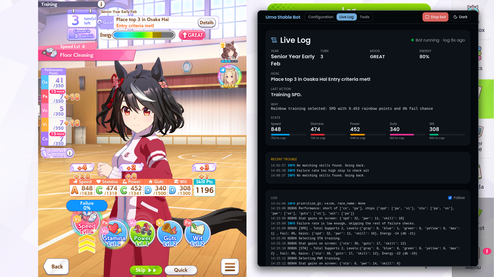

# Uma Autoplay

A bot that plays Umamusume careers for you: training, races, events, skills and the scenario mechanics, start to finish. It can run in the background on Linux while you use your desktop, and you watch and control it from a web page, including from your phone.



## Credits

Uma Autoplay started as a fork of [samsulpanjul/umamusume-auto-train](https://github.com/samsulpanjul/umamusume-auto-train) (its [discord server](https://discord.gg/vKKmYUNZuk), [demo video](https://youtu.be/CXSYVD-iMJk)), which was inspired by [shiokaze/UmamusumeAutoTrainer](https://github.com/shiokaze/UmamusumeAutoTrainer). It has since grown far enough apart to go by its own name. Thanks to both projects.

# ⚠️ USE IT AT YOUR OWN RISK ⚠️

I am not responsible for any issues, account bans, or losses that may occur from using it.
Use responsibly and at your own discretion.

## Features

- Automatically trains Uma, scoring each facility by support cards, rainbow bonds, hints and the stat gains read off the screen
- Stat caps: a stat that already hit its cap isn't trained further
- Keeps racing until the goal is met, always picking races with matching aptitude, plus your own race schedule
- Retries a lost goal race with an Alarm Clock (configurable)
- Checks mood, energy and debuffs, and rests, recreates or visits the infirmary when needed
- Picks event choices from the in-game Effects panel, or from your own list of chain-event picks
- Plays 3 game modes: URA Finale, Unity Cup and Grand Concert (see [Supported game modes](#supported-game-modes))
- Friend-card outings (Light Hello, Tazuna, Aoi, ...) priced as a whole chain
- Buys skills for what the Uma will actually run (run style and distances), and spends every point at career end
- Keeps a 3★ blue spark, or rerolls once for a better set
- Race position selection, overall or per distance
- Trainee picker with aptitudes and growth read from the game's own data
- Web page for configuration, a live log, one-click tools and a start/stop button, usable from your phone

## Supported game modes

| Game mode | What the bot handles |
| --- | --- |
| **URA Finale** | Training, goal races and your race schedule, and the URA Finale race days. |
| **Unity Cup** | Everything in URA Finale, plus Spirit gauges and Spirit bursts in training scores. An Extreme burst is taken even above the failure threshold, since it has no failure chance. |
| **Grand Concert** | Everything in URA Finale, plus the Lessons board, the song plan (18 songs for the gold "I Wanna Win With You"), the lyrics event, Performance points in training scores, and Light Hello's recreation chain. |

Pick the mode under **Game mode** on the web page (Trainee & strategy). **Auto-detect**, the default, recognises the mode from what it sees on screen: Spirit gauges for Unity Cup, the Lessons button for Grand Concert. Choosing a mode makes the bot use it from the first turn and skip looking for the others; it logs a warning if the screen shows a different mode. Trackblazer is not supported yet.

## Getting Started

### Requirements

- [Python 3.10+](https://www.python.org/downloads/)

### Setup

#### Clone repository

```
git clone https://github.com/AkiraVD/uma-autoplay.git
cd uma-autoplay
```

#### Install dependencies

Windows:

```
pip install -r requirements.txt
```

Linux (X11 session, game running in the Steam client under Proton):

```
sudo apt install wmctrl python3-tk
python3 -m venv .venv
.venv/bin/pip install torch==2.7.1 torchvision==0.22.1 torchaudio==2.7.1 --index-url https://download.pytorch.org/whl/cpu
.venv/bin/pip install -r requirements.txt
```

On Linux:
- Use an X11 session. Screen capture does not work on Wayland.
- Clicks go through a virtual mouse on `/dev/uinput`, so the game sees a real device. A normal desktop login can already write to it. If yours can't, the bot falls back to pyautogui and logs why.
- The `Pause` key is heard through the X server, so no root is needed.
- `master.mdb` is found in the Steam library automatically. Set `UMA_MASTER_MDB` if yours lives somewhere else.

To play in the background, with the game on a hidden display so your desktop stays free:
1. `bash tools/headless/start-display.sh` (asks for your sudo password; starts a second X server, `:1`, on the NVIDIA GPU).
2. In Steam, set the game's launch options to `DISPLAY=:1 %command%`, then start the game. It won't appear on your screen.
3. `./run_background.sh`, then press `Pause` on your desktop or **Start bot** on the web page.

The start script has to be run again after a reboot.

To undo it, run `bash tools/headless/stop-display.sh` and clear the launch options.

### BEFORE YOU START

Make sure these conditions are met:

- Screen resolution must be 1920x1080
- The game should be in fullscreen
- Your Uma must have already won the trophy for each race (the bot skips the race)
- In the game's Options → Require Confirmation, turn off "When selecting Rest", "When selecting Recreation" and "When selecting Infirmary"
- Start the career yourself (the bot doesn't start one), and set the story **Skip** button to ×2 at the start of each career: a new career resets it to Off
- Then start the bot once the career has begun

### Start

Run:

```
python main.py
```

On Linux: `./run_auto_uma.sh`

Press `Pause`, or use the **Start bot** button on the web page, to start/stop the bot.

### Web page

Open `http://127.0.0.1:8000/` in your browser. The page has three views:

- **Configuration**: everything the bot reads, grouped by what it affects (trainee and race strategy, rest and mood, training, skills, races, events, Grand Concert). Press **Apply** to save your changes; the bot reads them each time it starts, so stop and start it to use them mid-career. **Save**/**Load** keep presets as files.
- **Live Log**: the bot's log as it plays.
- **Tools**: health check, screenshot, "which screen is this", launch/close the game, advance or skip a race, and click anywhere on the game screen. Anything that clicks is refused while the bot is running.

The **Start bot**/**Stop bot** button in the top bar works like `Pause`. Use it when the page is opened from another device (for example over Tailscale), where a key press can't reach the bot. The page has a light and a dark theme.

### Training Logic

1. During the Junior Year, the bot trains where it builds friendship fastest, to unlock rainbow training early.
2. From the Classic Year on, it looks for rainbow training, falling back to the facility with the most support cards.

Both are skewed by your stat priority and weights, skip trainings above the failure threshold, and add scenario bonuses (Spirit gauge in Unity Cup, Performance points in Grand Concert).

### Known Issues

- Trainees with unusual goals, such as Gold Ship's restricted training, have no special handling and haven't been tested.
- The **Epithet** screen after a career isn't handled: press Confirm! yourself.
- The game itself can hang on its "communicating" spinner when its server connection drops, and taps then do nothing. Restart the game and press Continue Career, then start the bot again.

### Contribute

If you run into any issues or something doesn’t work as expected, feel free to [open an issue](https://github.com/AkiraVD/uma-autoplay/issues).
Contributions are very welcome!

## License

[MIT](LICENSE) — use it, change it, share it.

The upstream project this began as a fork of ships a disclaimer rather than a licence grant, so these terms cover the work in this repository.
